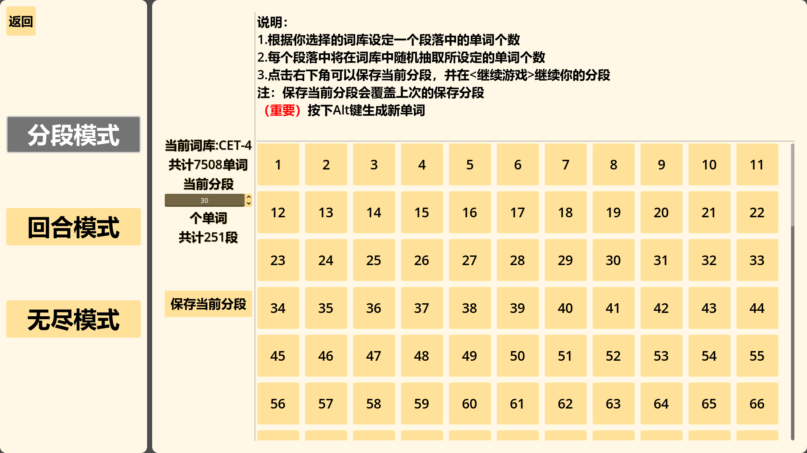
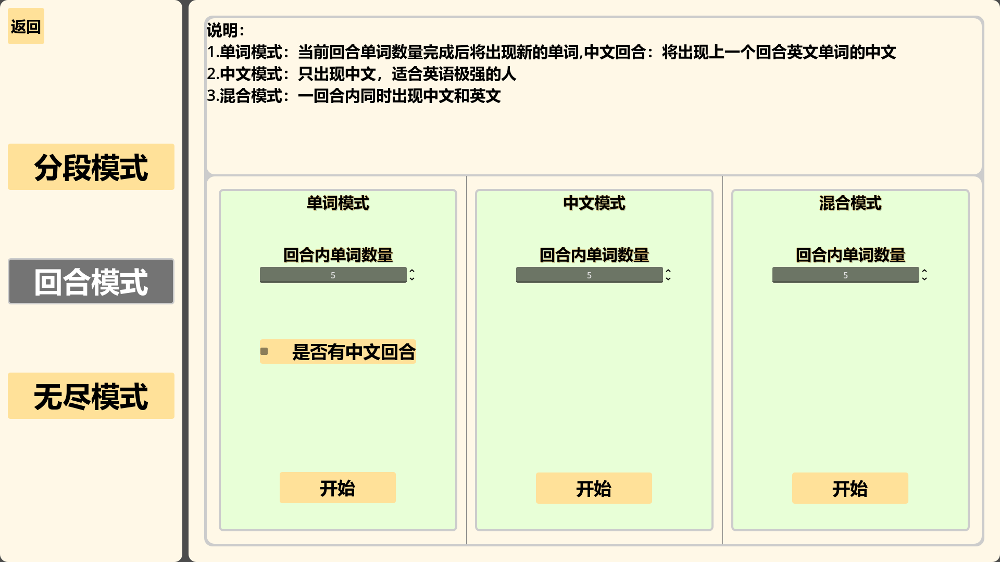
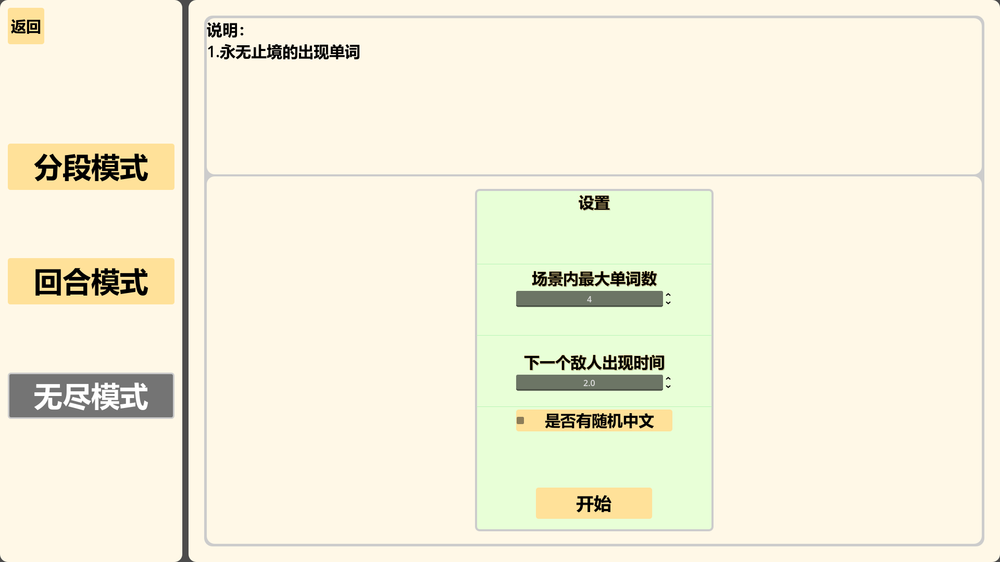
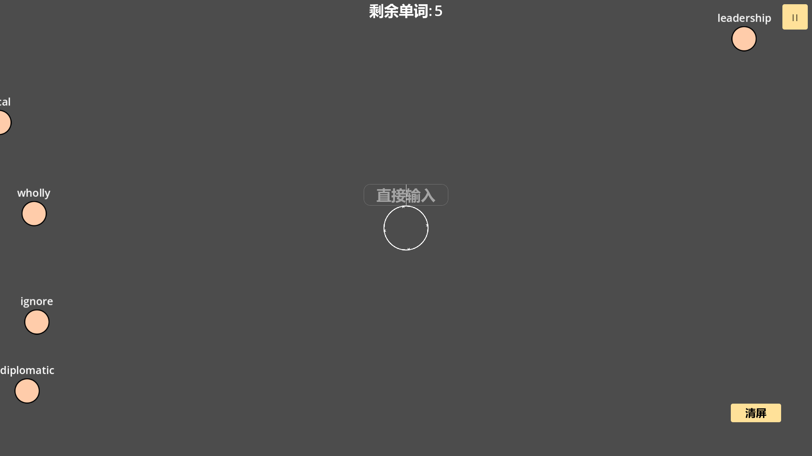

# 拼词连打
## 内容概述
这是一个立志于去以重复循环为主的背单词的项目，兼顾了一些挑战性项目

## 模式设计目的

### 分段模式
这个是最重要的模式，通过将上千个单词依据每段单词数量进行拆分，保证每一段内只出现固定数量的单词，不断重复强化记忆英语单词，同时支持当前分段的本地化保存，保证可以长时间的坚持记忆。

### 回合模式
算是一个挑战项目，分回合的出现单词，可自定义内容

### 无尽模式
也算是一个挑战项目，真-不断的出现单词，可自定义内容

## 已有功能
 - [x] TTS语音
 - [x] 小学->SAT阶段的全部单词
 - [x] 本地化保存分段
 - [x] 三大模式

## 未添加功能（以后如果有时间会添加）
 - [ ] 本地导入词库
 - [ ] 本地导入音乐播放和调节
 - [ ] 敌人移动速度调节
 - [ ] 单词统计功能
 - [ ] 核心血量（可选择是否开启）
 - [ ] 动态难度
